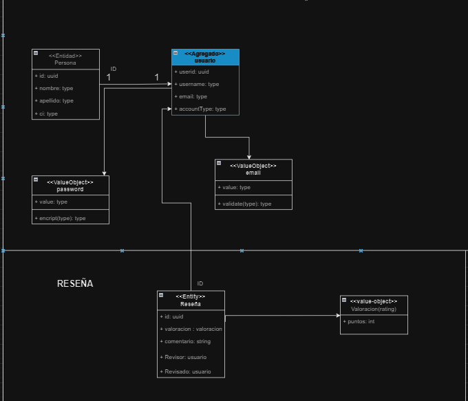
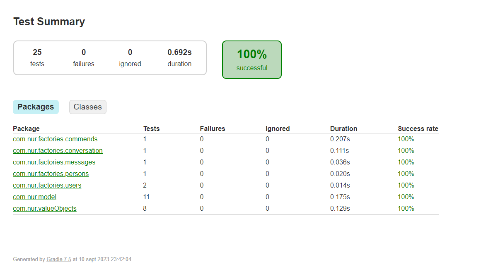
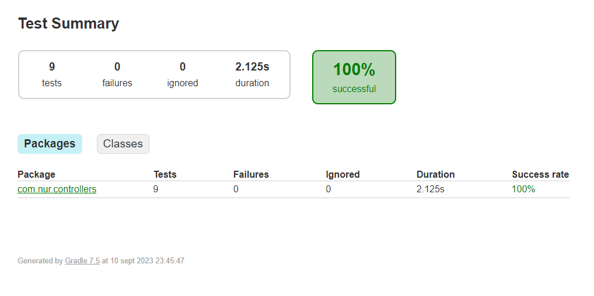
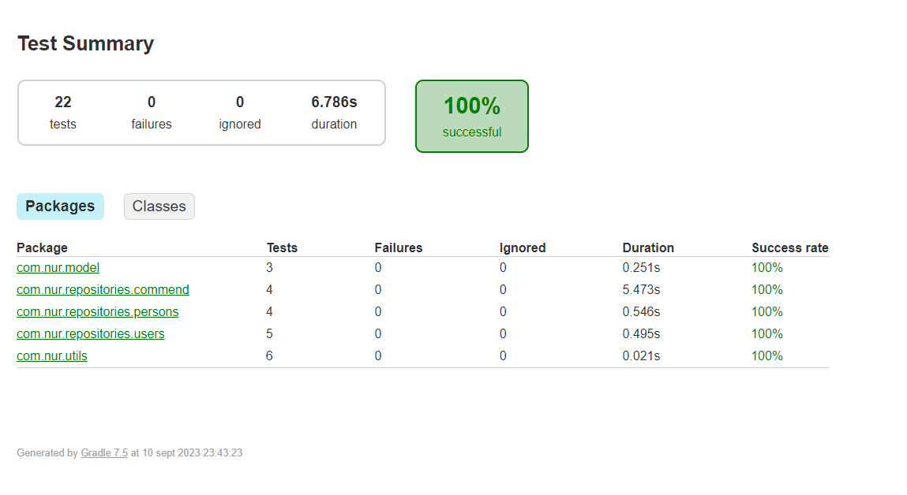
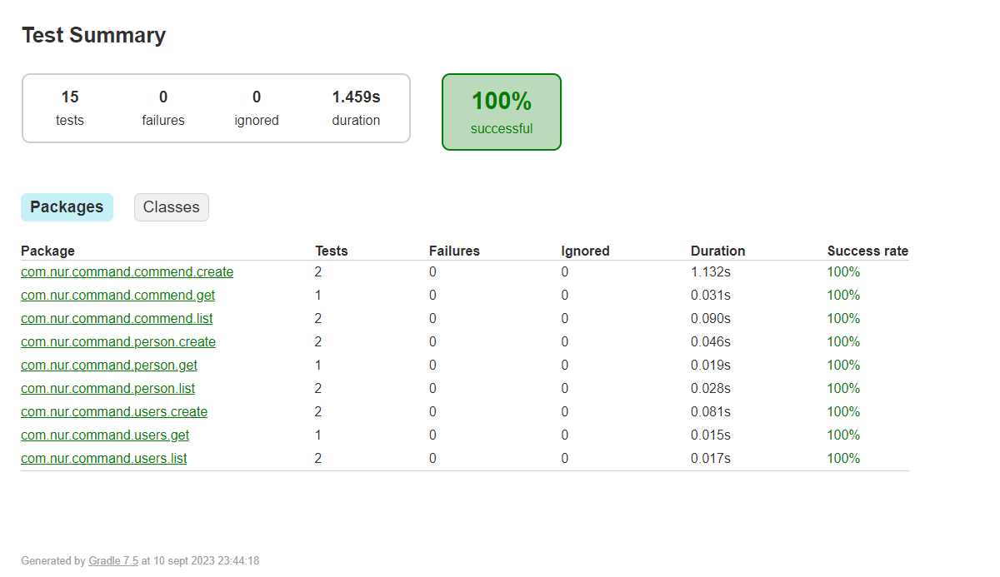

# MICRO SERVICIOS MENSAJERIA Y RESEÑA

El microservicio tiene por finalidad almacenar y manipular la informacion de la reseña y de los usuarios, asi mismo separar en capas los diferentes modulos de la implementacion.

* Registro de los usuarios.
  permite crear un usuario nuevo.
* Registro de las personas a un usuario.
  Permite registrar una persona a un usuario.
* Guardar reseña.
  Permite almacenar una reseña hecha por los usuarios.

### Video
[Video](https://drive.google.com/file/d/1dfPR7YQQniuQis__Mn_SfRxgjCs2UBUK/view?usp=drive_link)

### Repositorio
[Github](https://github.com/CrissVargasUAGRM/diplomado)

